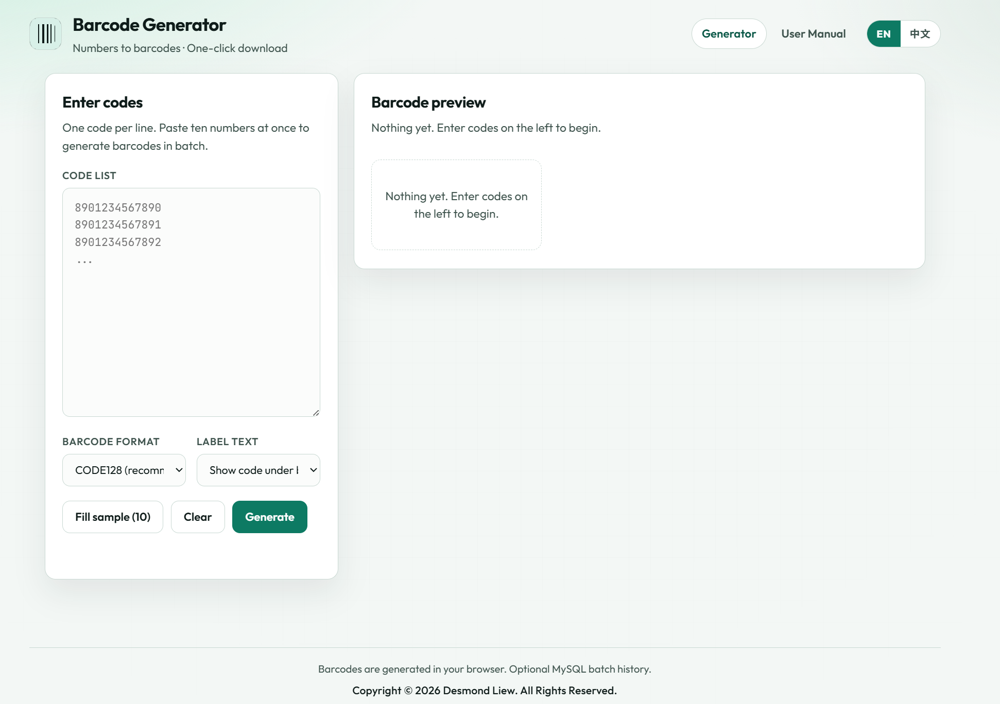
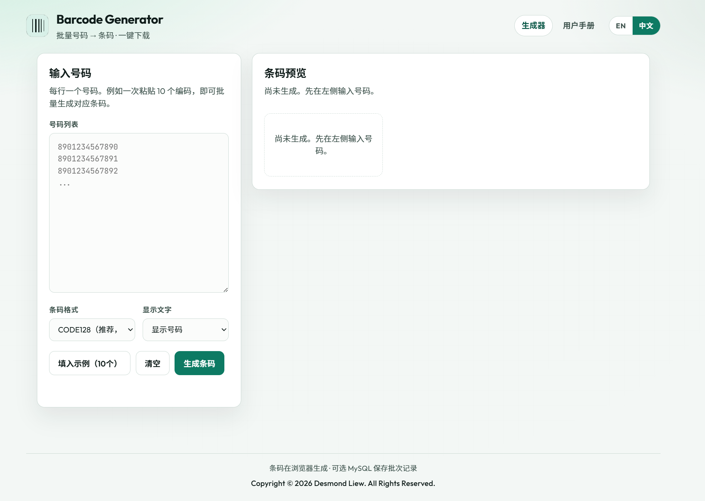
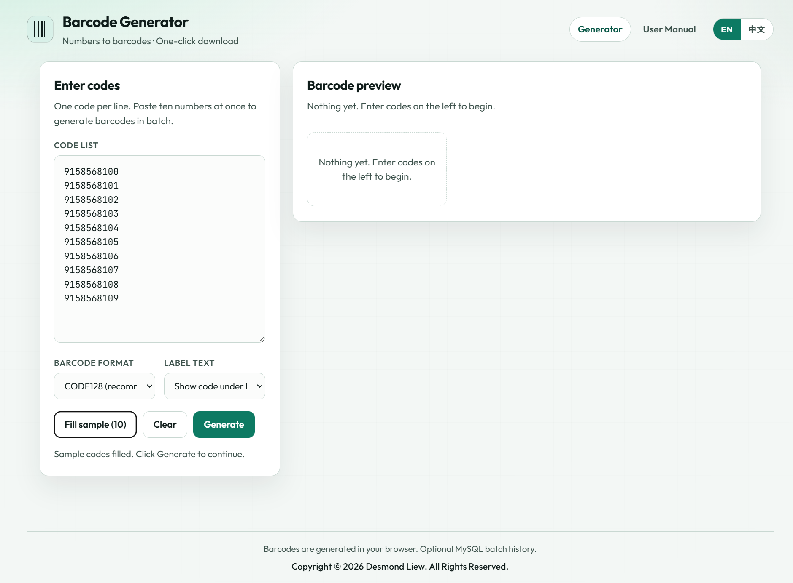

# 🏷️ Barcode Generator

A clean, batch-ready **Barcode Generator** built with **PHP · HTML · CSS · JavaScript · MySQL**.  
Paste multiple codes, preview barcodes instantly, then download them as **PNG** or a single **ZIP** — with full **English / 中文** support.

---

## ✨ Features

### 🔢 Batch Code Input
Enter one code per line (for example 10 numbers at once) and generate matching barcodes in a single click.

### 👁️ Live Preview
See every barcode rendered on screen with success / fail status before you download anything.

### 📥 Single & ZIP Download
Download any barcode as a **PNG**, or pack all successful barcodes into one **ZIP** archive.

### 🖨️ Print Ready
Use the browser print dialog to print only the barcode preview (input panel is hidden).

### 🌐 Bilingual UI
Switch between **EN** and **中文** anytime. Language is remembered via cookie, and the User Manual follows the same language.

### 📘 Built-in User Manual
A full-width desktop manual explains features, formats, downloads, and FAQ — no external docs required.

### 🗄️ Optional MySQL History
If you import the SQL schema, generation batches can be saved. Without a database, the app still works normally.

---

## 🏗️ Tech Stack

| Category | Technology |
|---|---|
| 🖥️ Frontend | HTML5, CSS3, JavaScript |
| 🔙 Backend | PHP |
| 🗄️ Database | MySQL (optional) |
| 📦 Barcode Engine | JsBarcode |
| 🗜️ ZIP Export | JSZip + FileSaver |
| 🏠 Local Server | XAMPP (Apache + MySQL) |
| ☁️ Hosting | Shared hosting friendly (e.g. iFastNet) |

---

## 📁 Project Structure

```
Barcode_Generator/
├── index.php                 # Main generator page
├── manual.php                # User Manual (follows language)
├── api/
│   └── save_batch.php        # Optional batch history API
├── assets/
│   ├── css/style.css
│   ├── js/app.js
│   └── screenshots/          # README screenshots go here
├── config/
│   └── db.php                # MySQL connection (optional)
├── includes/
│   ├── lang.php              # EN / 中文 translations
│   ├── header.php
│   └── footer.php
├── sql/
│   └── schema.sql            # Optional database schema
└── README.md
```

---

## ⬇️ How to Download This Project

Follow these steps carefully if you are downloading from **GitHub**.

### Method A — Download ZIP (easiest for beginners)

1. Open the repository page:  
   **https://github.com/dljk0927prog/Barcode_Generator**
2. Click the green **Code** button.
3. Click **Download ZIP**.
4. Wait until the browser finishes downloading  
   `Barcode_Generator-main.zip` (filename may vary slightly).
5. Go to your **Downloads** folder.
6. **Right-click** the ZIP file → choose **Extract All…** (Windows)  
   or double-click and extract (macOS).
7. Choose a destination folder, then click **Extract**.
8. After extraction, you should see a folder such as:  
   `Barcode_Generator-main`
9. Rename the folder to `Barcode_Generator` (optional, but recommended).
10. Move / copy that folder into your web server directory:
    - **XAMPP (Windows):** `C:\xampp\htdocs\`
    - Final path example: `C:\xampp\htdocs\Barcode_Generator\`

### Method B — Git Clone (for developers)

```bash
cd C:\xampp\htdocs
git clone https://github.com/dljk0927prog/Barcode_Generator.git
cd Barcode_Generator
```

---

## ⚙️ How to Install & Run (XAMPP)

### Step 1 — Start XAMPP
1. Open **XAMPP Control Panel**.
2. Start **Apache**.
3. (Optional) Start **MySQL** only if you want batch history.

### Step 2 — Confirm folder location
Make sure files are here:

```
C:\xampp\htdocs\Barcode_Generator\index.php
```

### Step 3 — Open in browser
Visit:

```
http://localhost/Barcode_Generator/
```

or:

```
http://localhost/Barcode_Generator/index.php
```

### Step 4 — (Optional) Enable MySQL history
1. Open **phpMyAdmin**: `http://localhost/phpmyadmin`
2. Click **Import**
3. Choose `sql/schema.sql`
4. Click **Go**
5. Default DB settings in `config/db.php`:
   - Host: `localhost`
   - Database: `barcode_generator`
   - User: `root`
   - Password: *(empty for default XAMPP)*

> If MySQL is not set up, barcode generate / download still works. History save is simply skipped.

---

## 🚀 How to Use the System

### 1) Generate barcodes
1. Open the **Generator** page.
2. In **Code list**, type or paste codes — **one code per line**.
3. Choose a barcode format (default: **CODE128** — recommended).
4. Choose whether to show the code text under each barcode.
5. Click **Generate**.
6. Check the preview cards on the right.

> Tip: Click **Fill sample (10)** first to try the full flow with demo codes.

### 2) Download
- Click **Download PNG** on one card to save a single image.
- Click **Download all ZIP** to pack every successful barcode into one ZIP file.

### 3) Print
- Click **Print** to print the preview barcodes from your browser.

### 4) Switch language
- Use **EN / 中文** in the top-right corner.
- The Generator and User Manual stay in sync.

### 5) Read the User Manual
- Click **User Manual** in the header.
- Desktop layout uses full content width (`width: 100%`).
- Manual content switches with your selected language.

---

## 🧾 Supported Barcode Formats

| Format | Best for | Notes |
|---|---|---|
| CODE128 | Digits, letters, symbols | Most flexible — recommended |
| CODE39 | Uppercase + digits | Smaller character set |
| EAN-13 | Retail products | Needs 12/13 digits |
| EAN-8 | Short product codes | Needs 7/8 digits |
| UPC-A | North American retail | Needs 11/12 digits |
| ITF-14 / MSI / Pharmacode | Logistics / industry | Must match format rules |

---

## 🖼️ Project Screenshots

| Generator (EN) | Generator (中文) |
|---|---|
|  |  |

| Barcodes Preview | Language Switch |
|---|---|
|  |  |

---

## 📺 Demo / Links

| Resource | Link |
|---|---|
| 🌐 Live URL | [desmondliewjiankai.kolejsynergy.com](https://desmondliewjiankai.kolejsynergy.com/) |
| 📘 User Manual | [Open Manual](https://desmondliewjiankai.kolejsynergy.com/manual.php) |
| 💻 Local (XAMPP) | `http://localhost/Barcode_Generator/` |
| 📦 GitHub Repository | [dljk0927prog/Barcode_Generator](https://github.com/dljk0927prog/Barcode_Generator) |

---

## ✅ Quick Test Plan

- [ ] Open homepage in English by default
- [ ] Fill 10 sample codes and generate successfully
- [ ] Download one PNG
- [ ] Download all as ZIP and unzip to verify images
- [ ] Switch to 中文 and confirm UI + manual language change
- [ ] Print preview (optional)

---

## 📄 License / Copyright

Copyright © 2026 Desmond Liew. All Rights Reserved.

---

⭐ If this project helps you, please star the repository!  
✨ Feel free to explore, fork, and improve it.
